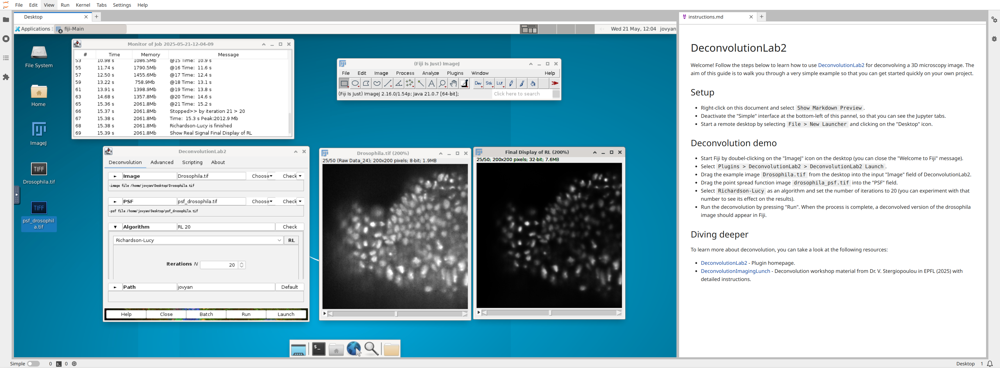

# Fiji - DeconvolutionLab2 runnable example on Binder

Launch the app on Binder:

This project uses [jupyter-remote-desktop-proxy](https://github.com/jupyterhub/jupyter-remote-desktop-proxy) and was templated from [binder-desktop-app-template](https://github.com/binder-templates/binder-desktop-app-template?tab=readme-ov-file).
It was inspired by the 2025 [DeconvolutionImagingLunch](https://github.com/EPFL-Center-for-Imaging/DeconvolutionImagingLunch/tree/main) workshop given by Dr. V. Stergiopoulou in EPFL. 